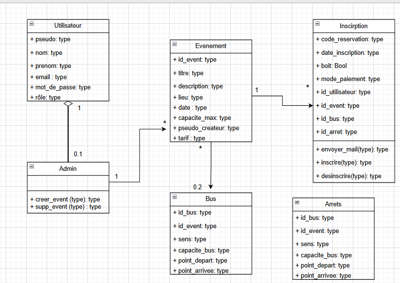

L'ensemble du groupe a réfléchi en commun sur la conception du diagramme UML et du diagramme GANTT, ainsi que sur la conduite des réunions. Nous avons pu discuter des échéances et de nos objectifs pour répondre à ces échéances.

Nadia :
Formalisation du diagramme UML 
Planification des réunions de suivi et des compte-rendus

Martin :
- Formalisation du diagramme de Gantt
- Distinction des différentes taches à réaliser

Valentin :
- création du fichier de dossier d’analyse
- rédaction de la compréhension du besoin
- accord avec l'équipe du plan du dossier d'analyse

Lucas :
- création du diagramme d'activité (1er jet)
